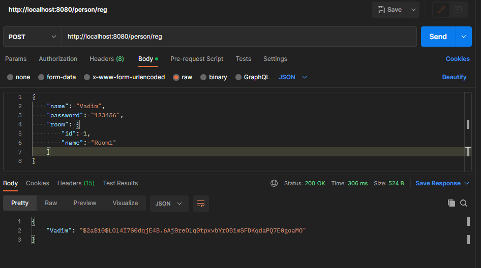
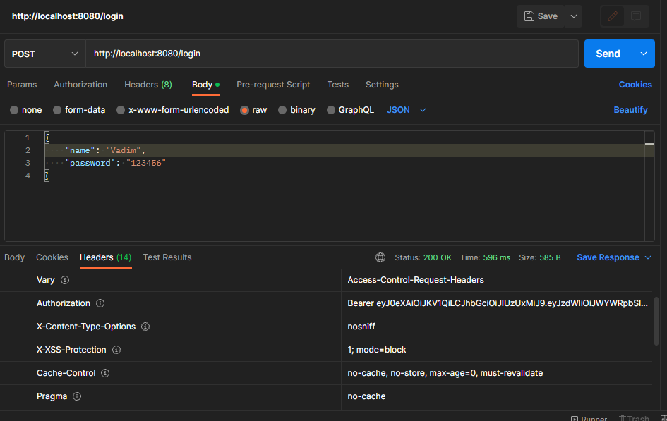
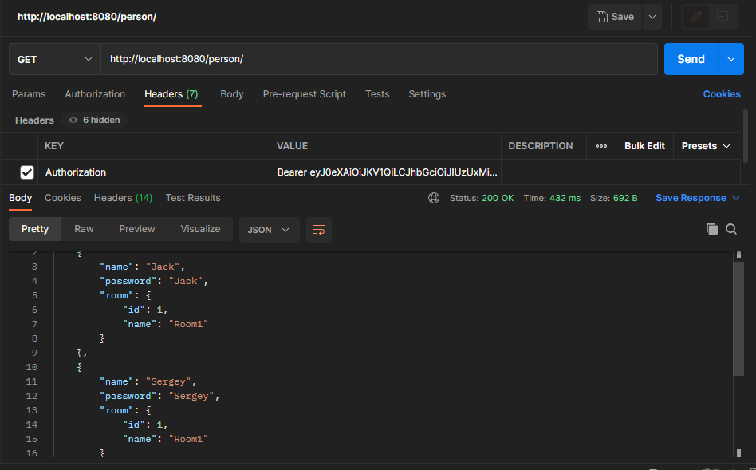
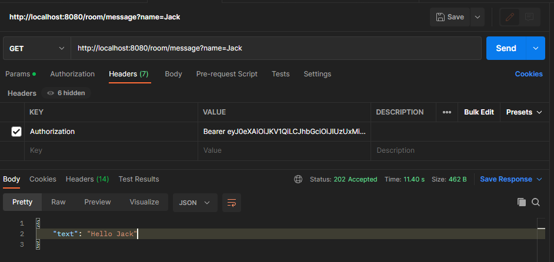
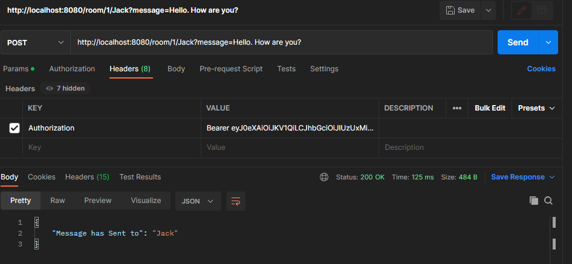
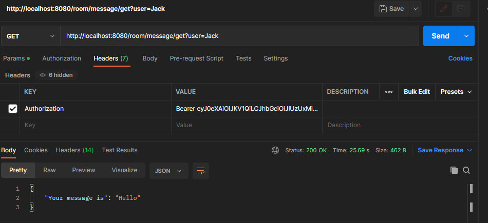

# Educational project. Collection of REST services
## Service "Chat"

### Functionality

* REST service users chat
* Connected via RestTemplate to the user authorization service

### Assembly and installation:
#### Using Spring Boot CLI:
1. Create "db_chat" database by default or your own database
2. Change your PostgreSQL database username and password in '/src/main/resources/app.properties' and '/chat/src/main/resources/application.properties'

```shell
mvn liquibase:update
mvn spring-boot:run -Dspring-boot.run.arguments=--db=your_database,--user=your_user,--password=your_password,--port=your_port
```
OR using default properties(db=db_chat, user=postgres, password=password, port=8080)
```shell
mvn liquibase:update
mvn spring-boot:run
```
Using Java CLI
```shell
mvn liquibase:update
mvn install -Dmaven.test.skip=true
```
```shell
java -jar target/chat-0.1-SNAPSHOT.jar --db=db_chat --user=postgres --password=password --port=your_port
```
OR default settings (db=db_chat, user=postgres, password=password, port=8080)
```shell
mvn liquibase:update
java -jar chat/target/chat-0.1-SNAPSHOT.jar
```

### TODO list
This program can:
* CRUD operations REST API for Users, Roles and Rooms
  * User registration POST http://localhost:8080/person/reg
   IN THE REQUEST BODY JSON object. For Example
    {
    "name": "User",
    "password": "123456",
    "room": {
    "id": 1,
    "name": "Room1"
    }
    }
  * User authorization POST http://localhost:8080/login. You should contain the username and password in the body of JSON request
    For example 
    {
    "name": "User",
    "password": "123456"
    }
  Get the token in the HEAD response "Authorization": "Bearer <your_token>"
  * Get a list of all users GET http://localhost:8080/person/
  * Get user by id GET http://localhost:8080/person/id, where id is the number in database
  * Remove user from database DELETE http://localhost:8080/person/id, where id is the number in database

* The user must register in the system
* The user logs in and the program issues a token
* The user can log into the system using his token.
* Through GET, POST requests to the room, users can communicate with each other
* Make a POST request http://localhost:8080/room/message/{id}/{user}?message=<message>, where id is the room number, user is the recipient of the message
* Make a GET request http://localhost:8080/room/message/get?user=<recipient name>

### Used technologies:


### Screenshots of working program using Postman
* Registration
 \
* Login \

* Get all users

* Send a message

* Send a message to a person

* Get message for specified person


# Auth service
### User authorization REST service. It uses Json Web Token for authorization.

# Employees service
### Employee REST service. It is connected via RestTemplate to the user authorization service.
>
### Contact:
If you have any questions, feel free to contact me https://t.me/VadimDedeyko


<!-- 
brightgreen
green
yellowgreen
yellow
orange
red
blue
lightgrey
success
important
critical
informational
inactive
blueviolet
ff69b4
9cf 
-->
